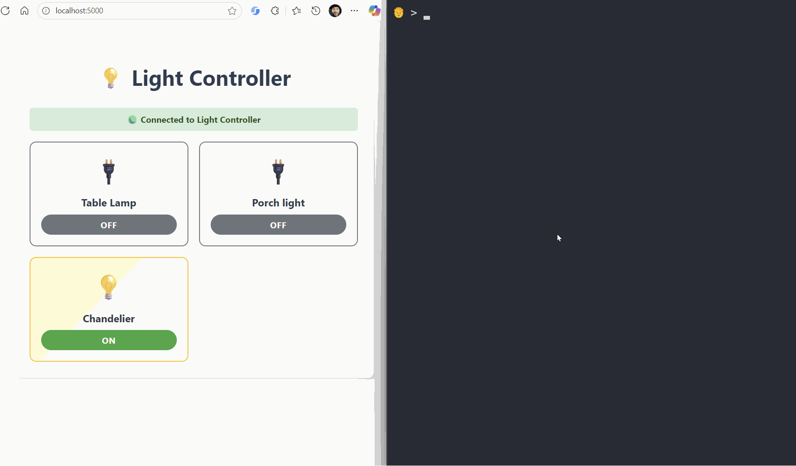

# VS Live 2025 - San Diego - Semantic Kernel Samples

## Demo 1 - Light the light

Introduction to Semantic Kernel and Function Calling.



Folder: [light-the-light](./light-the-light)

## Demo 2 - Multi Agent

Use [azure-sql-nl2sql](https://github.com/Azure-Samples/azure-sql-nl2sql) repo. It shows how to use Two-Experts Agent Model to generate high-quality SQL queries from Natural Language request

Use the following question as an example

```text
Hi, can you help me figure out what is our best selling product in each market we operate, and what would be a cross selling opportunity with another product? 
```

## Demo 3 - Vector Data

Shows how to use Vector Data with Semantic Kernel.

Folder: [vector-data](./vector-data)

## Demo 4 - Insurance Chatbot

Shows how to build an insurance chatbot using Azure SQL, Vectors, Tools, Agents, Semantic Kernel and Azure OpenAI.

Repo: [insurance-chatbot-demo](https://github.com/Azure-Samples/azure-sql-db-chat-sk/tree/insurance-chatbot-demo)